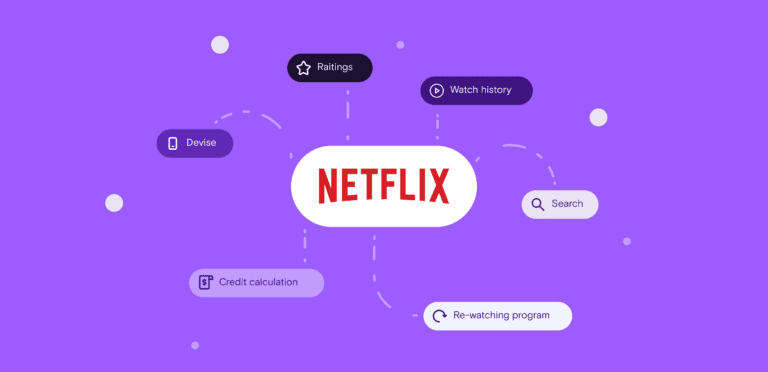

  
  <h2 style="margin-top: 20px; color: #333;">Tanmay Kadam</h2>
  

   Building a system like Netflix’s might sound tricky, but it’s really about doing basic math. In this blog, we’ll talk about simple steps to create our own recommendation system on netflix data. It’s like putting together a puzzle that knows what you want to watch next. Let’s get started on making our own movie buddy!  
  ---------------------------------------------------- 
     Our little movie buddy didn't just come to life by magic. We used a mix of math, machine learning models, and a bit of common sense with stats to build it. By teaching the computer how to recognize patterns in what we watch, we've given it the tools to suggest new movies and shows we might like. It's fascinating how combining numbers, smart algorithms, and our own understanding of what makes a show interesting can create something so useful. This journey shows that with the right ingredients, anyone can blend technology and creativity to make something amazing. Let's keep exploring and building together!

Figuring out which clue(mutation) are important is reading a bunch of pile of literature and reaching a destination. SO we are just going to ease on there effort and time by automating the process of classifying important features(mutations) and making this diagnosis more easy and subtle.
  

  <a href="https://medium.com/@tanmay.kdm/navigating-recommendation-engine-22c54c8ccfe4" style="display: inline-block; margin-top: 20px; background-color: #1a8917; color: white; padding: 10px 20px; text-decoration: none; border-radius: 5px; font-weight: bold; box-shadow: 0 2px 4px rgba(0,0,0,0.2);">
    Read More
  </a>

